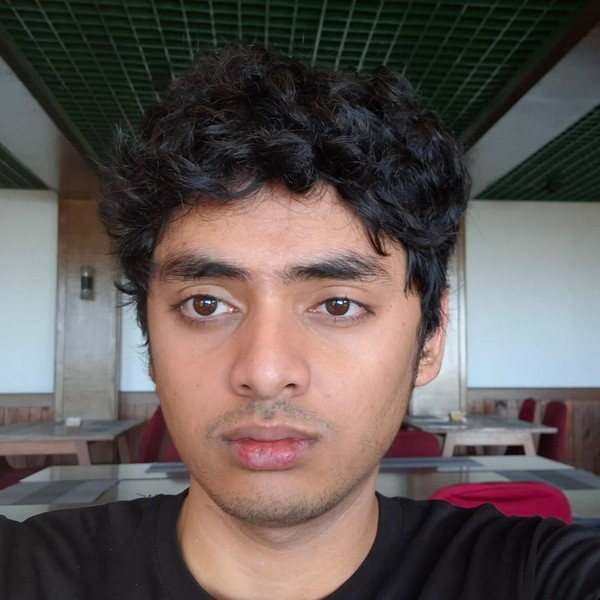
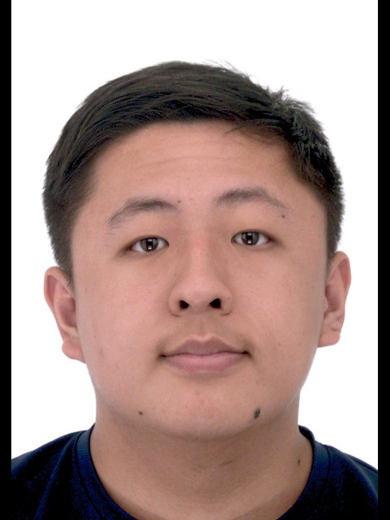
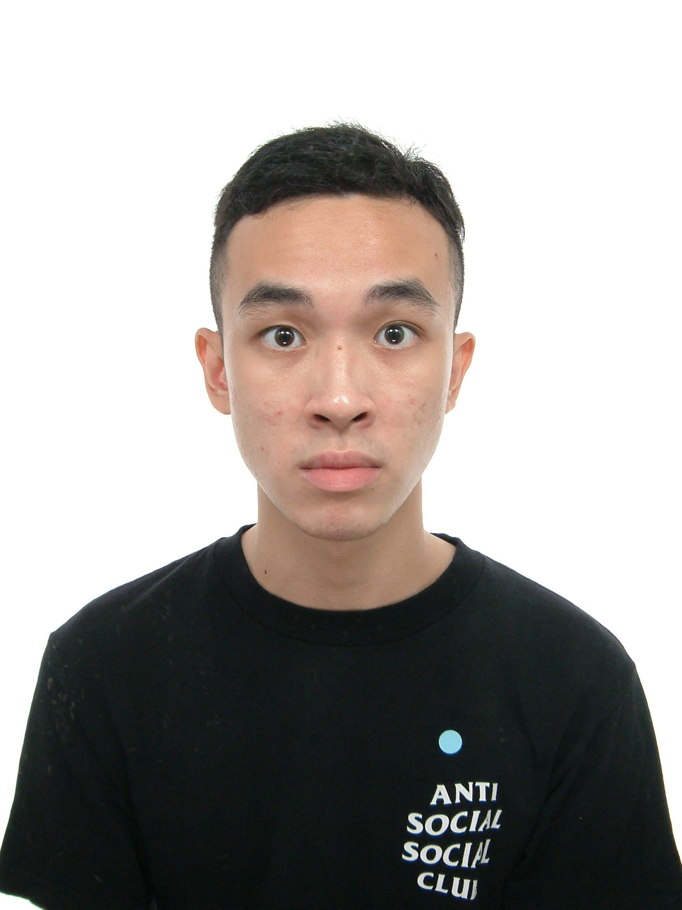

We are a team based in the [School of Computing, National University of Singapore](https://www.comp.nus.edu.sg).

You can reach us at the email `seer[at]comp.nus.edu.sg`

## Project team

### John Doe

[[homepage](http://www.comp.nus.edu.sg/~damithch)]
[[github](https://github.com/johndoe)]
[[portfolio](team/johndoe.md)]

* Role: Project Advisor

### Muhammad Salman Al Farisi

[[github](https://github.com/SalmanAlfarisi5)]

* Role: Developer
* Responsibilities: Project management (deadlines and scheduling), Code quality

### Tan Ying

[[github](http://github.com/arcs1ne)]

* Role: Developer
* Responsibilities: Code contribution and testing

### Jean Doe

[[github](http://github.com/johndoe)]
[[portfolio](team/johndoe.md)]

* Role: Developer
* Responsibilities: Dev Ops + Threading

### Ryan Chiew

[[github](https://github.com/ry-cy)]

* Role: Developer
* Responsibilities: Code contribution, quality and Testing
