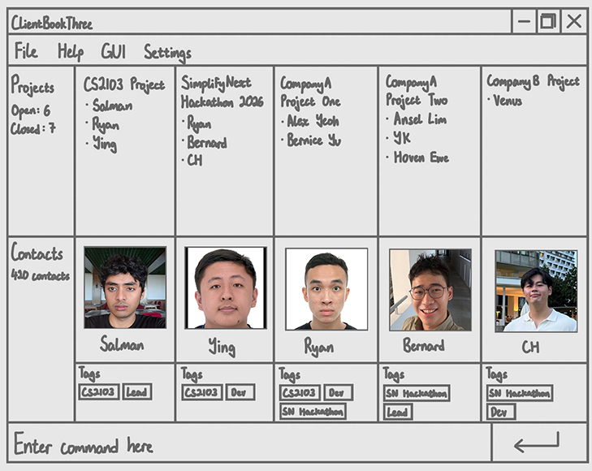

**ClientBookThree is a desktop contact manager for freelance software developers.** Track clients and project contacts based on their tags and groups easily.through a fast command-first workflow, with a GUI for viewing your contact list. While it has a GUI, most of the user interactions happen using a CLI (Command Line Interface).

* Start using ClientBookThree with the [_Quick Start_ section of the **User Guide**](UserGuide.html#quick-start).
* Learn how ClientBookThree works in the [**Developer Guide**](DeveloperGuide.html).

**Acknowledgements**

* Libraries used: [JavaFX](https://openjfx.io/), [Jackson](https://github.com/FasterXML/jackson), [JUnit5](https://github.com/junit-team/junit5)
